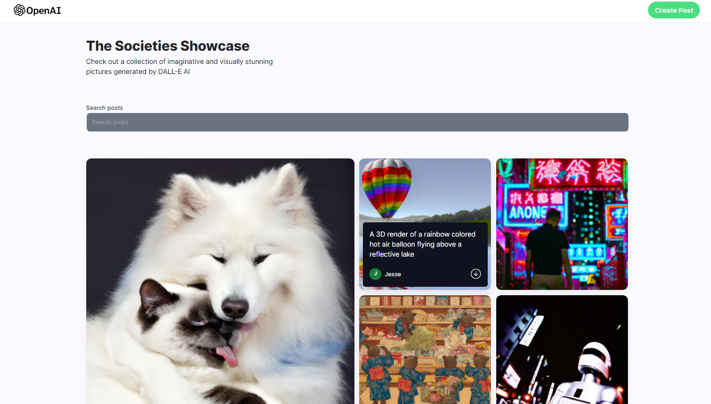
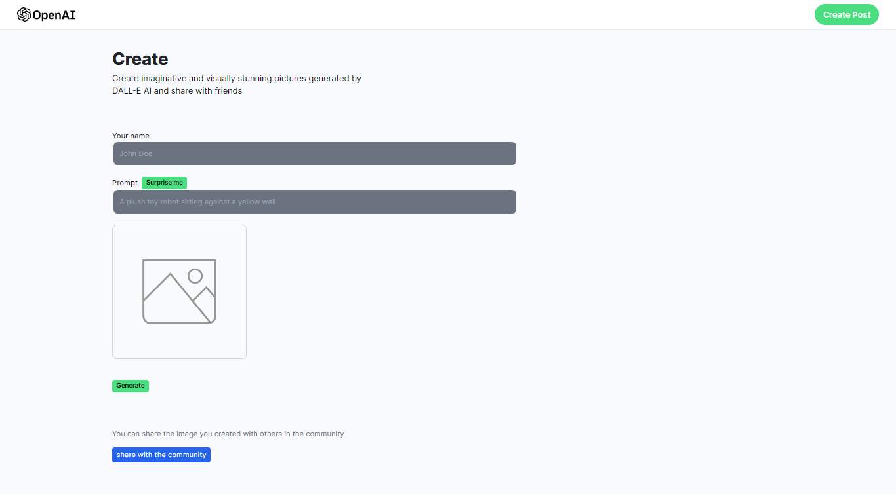
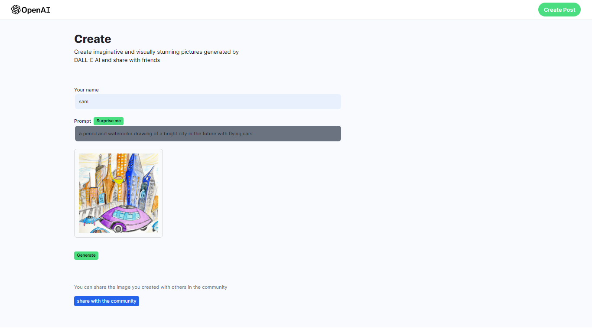

# Project Description

An AI-image generator web-app integrated with DALLE api. It allows users auto generate random images using different prompts. Cloudinary is used to save pictures.

# Screenshots

## Installation and usage

Clone this repository

git clone git@github.com:SamYusuf101/MERN-AI-image-generator.git

## Install packages

npm install\
npm run dev

## Star, Fork, Clone & Contribute

Feel free to contribute to this repository
